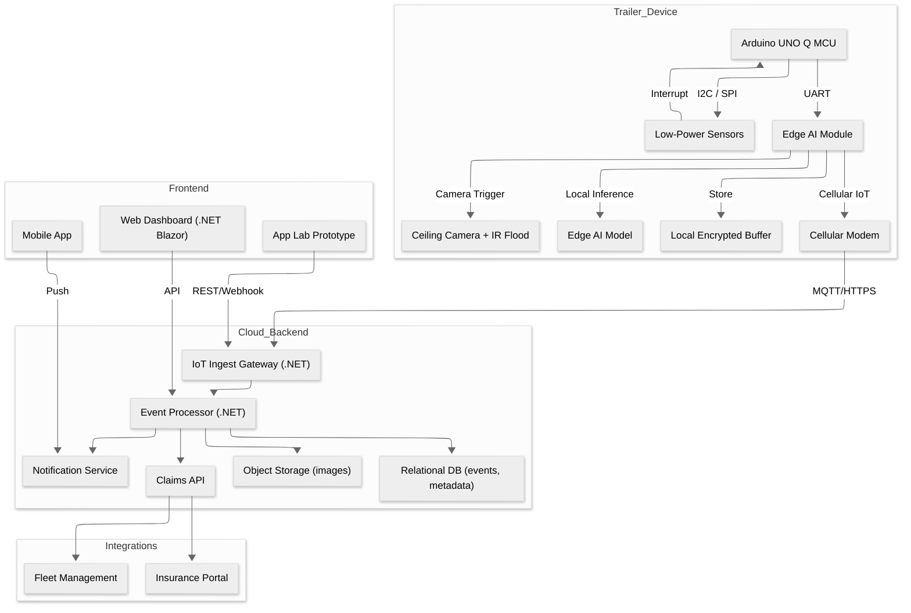

# Overview

Cargo Sentry connects ultra‑low‑power trailer hardware to an edge AI module and a .NET cloud backend, delivering a visual chain of custody with wake‑on‑event efficiency. The architecture is modular so hardware, edge inference, and cloud services can be developed, tested, and scaled independently.

Purpose: detect meaningful events with minimal power and wake the edge module only when necessary.

    Sensors remain in ultra‑low‑power standby; interrupts wake the MCU.

    MCU validates trigger patterns (debounce, signature) before waking the edge module.

    Camera and IR must power on within ~50 ms to capture the event window.

